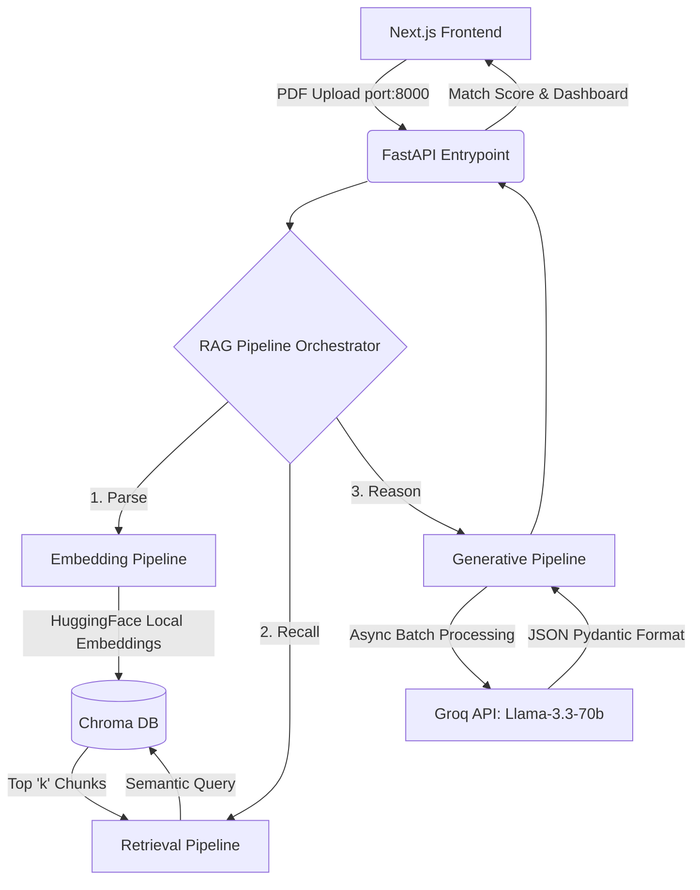

# 🚀 RFP Insight Engine
*An Enterprise Retrieval-Augmented Generation (RAG) dashboard that automatically shreds Government Contracts (RFPs), extracting compliance matrices, risk assessments, and technical specifications.*

---

## 🏗️ Architecture Overview

The system is designed as a fully decoupled monorepo. It features a React-based client and a highly modularized FastAPI Python backend built with LangChain.



### 🧠 The Modular RAG Design
We broke the monolithic document analysis into three separate micro-pipelines to ensure system stability, prevent AI hallucinations, and strictly avoid LLM context-window limits.

1. **`embedding_pipeline.py`**: Intercepts the PDF utilizing the `unstructured` library, cleanly preserving tables and bounds. It chunks data via `RecursiveCharacterTextSplitter` and embeds them entirely offline into Chroma using HuggingFace's `all-MiniLM-L6-v2`.
2. **`retrieval_pipeline.py`**: Executes a dense semantic search prioritizing absolute compliance language ("Shall, Must, Will"). It returns an array of pure text chunks (rather than one giant string).
3. **`generation_pipeline.py`**: Asynchronously iterates over the text chunks using an `asyncio` loop over `chain.ainvoke()`. It dodges strict rate limits by buffering requests with synthetic delays, dynamically mapping the chunk payloads into a massive, highly formatted Pydantic object.

---

## ✨ Key Features
- **Dynamic Feasibility Score**: Automatically penalizes RFP feasibility based on the density of "Medium" and "High" risk flags extracted.
- **Asynchronous Loop Generation**: Safely process massive 100+ page datasets piece-by-piece without crashing API token-limits.
- **Strict Data Contracts**: LLM outputs are rigorously constrained using LangChain's `with_structured_output` JSON validations to prevent the Next.js React client from crashing due to malformed payloads.

---

## 💻 Tech Stack
**Frontend**: Next.js 15, React, Tailwind CSS, Shadcn UI, Framer Motion
**Backend API**: FastApi, Uvicorn, Python 3.12+ 
**AI Engine**: LangChain, ChromaDB, HuggingFace (`all-MiniLM-L6-v2`), Pydantic
**LLM Inference**: Groq API (`llama-3.3-70b-versatile`)

---

## 🚀 Execution & Setup Guide

Ensure you have Node.js and Python installed before preceding.

### 1. Environment Variables
Inside the root of the `/backend/` directory, create a `.env` file and insert your Groq API key:
```env
GROQ_API_KEY=gsk_your_api_key_here
```

### 2. Run the Python Backend
From the root of your project directory, execute the PowerShell boot script.
```powershell
.\start_backend.ps1
```
*Alternatively, you can manually initialize the virtual environment and start FastAPI via python:*
```powershell
python backend/entrypoint/api.py
```
> The API will launch on `http://localhost:8000`

### 3. Run the Next.js Frontend
Open a completely new, **second terminal window**, navigate down into the frontend client, and spin up the development server.
```powershell
cd frontend
npm run dev
```
> The dashboard will instantly be available at `http://localhost:3000`!

---

## 🔬 Code Spotlight: Avoiding Token Limits
Instead of feeding raw massive text blocks into the LLM and crashing the server, we utilize an async loop inside `generation_pipeline.py` to batch arrays safely and dodge free tier TPM (tokens-per-minute) API rate limits:

```python
for idx, chunk in enumerate(chunks):
    # Asynchronous generation
    result = await chain.ainvoke({"context": chunk})
    
    # Safely Aggregate logic ...
    if result.compliance_matrix: 
        aggregated.compliance_matrix.extend(result.compliance_matrix)
        
    # Dynamic delay buffer to dodge token overflow rate-limits strictly on free API tiers
    if idx < len(chunks) - 1:
        await asyncio.sleep(5) 
```
